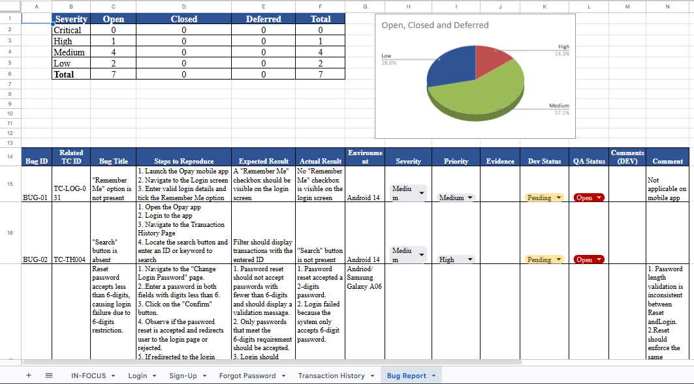

# 🐞 Bug Reporting & Defect Management

> Delivering clear, actionable, and reproducible defect reports that enable development teams to resolve issues efficiently and improve overall software quality.

---

## Overview

Finding defects is only part of a QA Engineer's responsibility. Equally important is communicating those defects in a way that enables developers, product owners, and stakeholders to understand, prioritize, reproduce, and resolve them efficiently.

Throughout my QA career, I have maintained structured defect reporting standards that improve collaboration and accelerate issue resolution across engineering teams.

---

## Defect Management Process

```text
Requirement
      │
      ▼
Test Execution
      │
      ▼
Issue Identified
      │
      ▼
Investigation
      │
      ▼
Bug Report Creation
      │
      ▼
Developer Review
      │
      ▼
Bug Fix
      │
      ▼
Retesting
      │
      ▼
Regression Testing
      │
      ▼
Closure
```

---

## Bug Report Template

Every defect report includes:

- Summary
- Description
- Environment
- Preconditions
- Steps to Reproduce
- Expected Result
- Actual Result
- Severity
- Priority
- Supporting Evidence
- Browser / Device Information
- Logs (where applicable)
- Attachments (Screenshots / Videos)

---

## Severity Levels

| Severity | Description |
|-----------|-------------|
| Critical | System unusable or complete functionality failure |
| High | Major functionality affected with no acceptable workaround |
| Medium | Functionality affected but workaround exists |
| Low | Minor issue with minimal business impact |
| Cosmetic | UI or visual issue with no functional impact |

---

## Priority Levels

| Priority | Description |
|----------|-------------|
| P1 | Immediate fix required |
| P2 | High business importance |
| P3 | Normal development cycle |
| P4 | Future improvement |

---

## Supporting Evidence

To improve reproducibility, I attach evidence whenever possible:

- Screenshots
- Screen recordings
- Browser console logs
- Network logs
- SQL validation results
- API responses
- Device information

---

## Tools Used

| Tool | Purpose |
|------|---------|
| Jira | Defect Tracking |
| Google Sheets | Defect Reporting |
| Browser DevTools | Investigation |
| SQL | Backend Validation |
| Postman | API Verification |
| OBS / Screen Recording | Video Evidence |

---

## Defect Lifecycle

```text
New
 │
 ▼
Assigned
 │
 ▼
In Progress
 │
 ▼
Fixed
 │
 ▼
Retest
 │
 ├── Failed → Reopened
 │
 ▼
Closed
```

---

## Sample Bug Report

- 

Recommended examples:

- Jira Bug
- Google Sheets Defect Log
- Markdown Bug Report
- PDF Bug Report

---

## Best Practices

- Write concise and descriptive summaries.
- Provide clear reproduction steps.
- Include expected and actual results.
- Assign appropriate severity and priority.
- Attach supporting evidence.
- Verify fixes before closing defects.
- Perform regression testing after resolution.

---

## Business Impact

A structured defect management process helps:

- Reduce communication gaps
- Improve developer productivity
- Accelerate issue resolution
- Improve release quality
- Increase stakeholder confidence
- Maintain traceability throughout the software development lifecycle

---

## Skills Demonstrated

- Defect Management
- Root Cause Analysis
- Bug Reporting
- Regression Testing
- QA Documentation
- Jira
- Google Sheets
- SQL Validation
- API Verification
- Stakeholder Communication

---

## Lessons Learned

Effective bug reporting is not just about identifying defects, it's about providing enough context for teams to reproduce, understand, prioritize, and resolve issues efficiently. Well-written defect reports reduce back-and-forth communication, shorten resolution time, and contribute to delivering higher-quality software.