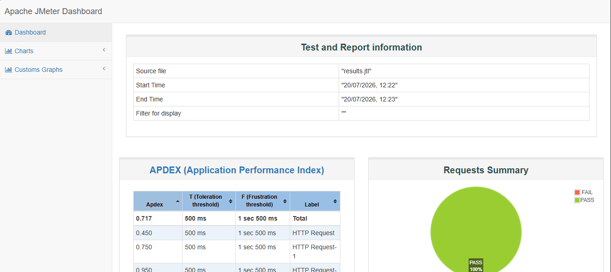

# ⚡ Performance Engineering

> Designing and executing performance tests to evaluate application scalability, stability, reliability, and responsiveness under varying workloads.

---

## Overview

Performance testing is essential for ensuring applications remain responsive, reliable, and scalable under expected and peak user loads.

Throughout my QA journey, I have used Apache JMeter to evaluate application performance, identify bottlenecks, validate system behavior under stress, and provide actionable insights that improve software reliability.

---

## Objectives

- Measure application response times
- Validate system stability under load
- Identify performance bottlenecks
- Evaluate scalability
- Support release readiness
- Improve user experience

---

## Technologies

| Tool | Purpose |
|------|---------|
| Apache JMeter | Load & Performance Testing |
| CSV Data Sets | Test Data |
| HTTP Request Samplers | API/Web Testing |
| Listeners | Result Analysis |
| Assertions | Validation |
| HTML Reports | Performance Reporting |

---

## Types of Performance Testing

### Load Testing

Validate application performance under expected user load.

---

### Stress Testing

Determine system breaking points under extreme traffic.

---

### Spike Testing

Evaluate how the application reacts to sudden traffic increases.

---

### Endurance Testing

Measure stability during prolonged execution.

---

### Scalability Testing

Assess how the application scales as workload increases.

---

## Performance Metrics

The following metrics are monitored during execution:

- Average Response Time
- Minimum Response Time
- Maximum Response Time
- Throughput
- Error Rate
- Transactions Per Second
- CPU Utilization
- Memory Utilization
- Network Usage

---

## Typical Workflow

```text
Performance Requirements
          │
          ▼
Test Planning
          │
          ▼
Test Script Development
          │
          ▼
Load Execution
          │
          ▼
Results Collection
          │
          ▼
Analysis
          │
          ▼
Recommendations
```

---

## JMeter Components Used

- Thread Groups
- HTTP Request Samplers
- CSV Data Sets
- Timers
- Assertions
- Listeners
- Variables
- Controllers

---

## Best Practices

- Start with baseline testing
- Use realistic user loads
- Gradually increase concurrency
- Monitor infrastructure metrics
- Validate response data
- Analyze bottlenecks before optimization
- Repeat tests after improvements

---

## Sample Reports

- 

---

## Business Impact

Performance testing helps organizations:

- Prevent production outages
- Improve application reliability
- Enhance customer experience
- Support capacity planning
- Reduce performance-related incidents
- Increase deployment confidence

---

## Skills Demonstrated

- Apache JMeter
- Load Testing
- Stress Testing
- Spike Testing
- Endurance Testing
- Performance Analysis
- Bottleneck Identification
- Capacity Planning
- Performance Reporting

---

## Lessons Learned

Performance engineering is more than executing load tests, it is about understanding system behavior, identifying bottlenecks, and providing data-driven recommendations that improve scalability, reliability, and user experience.