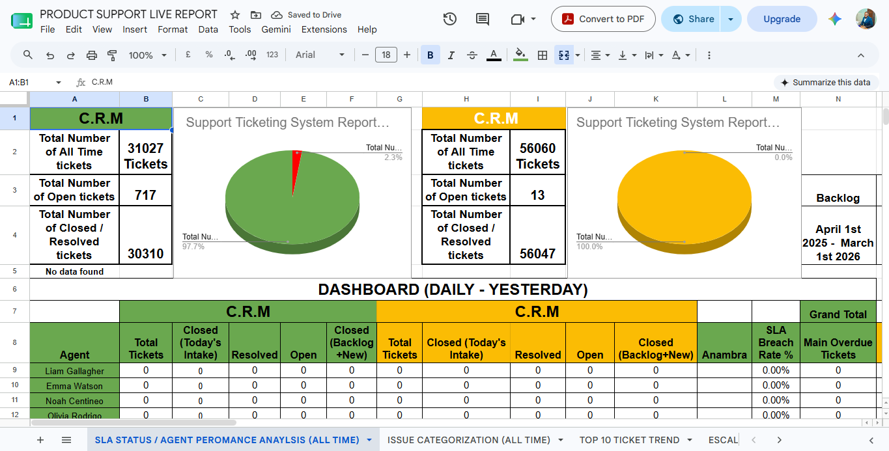
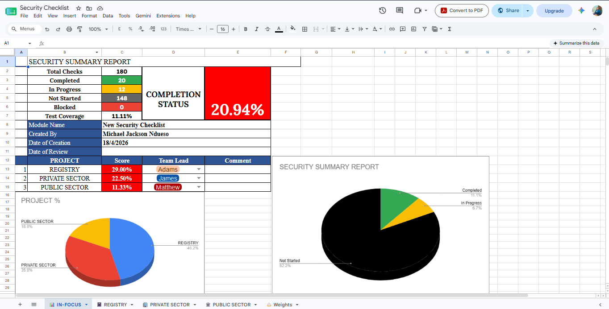
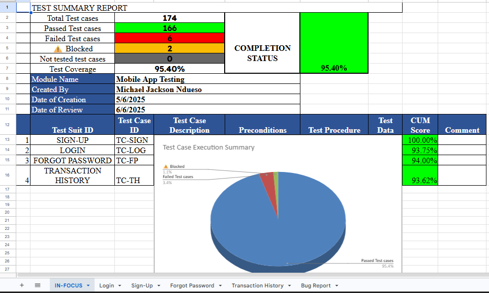
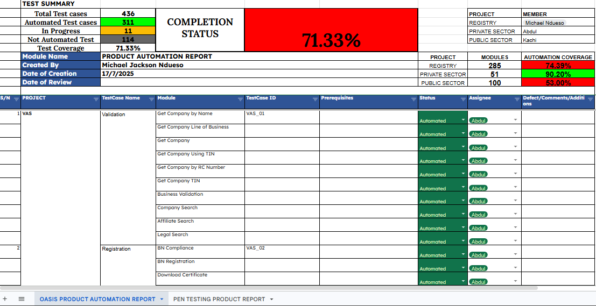

# 📊 Reporting Systems & QA Dashboards

> A collection of reporting systems, operational dashboards, QA metrics, and automation solutions engineered using Google Sheets to improve visibility, automate reporting, and support data-driven decision making.

---

# Overview

One of my favourite engineering projects is designing automated QA dashboards.

Rather than relying on manually updated spreadsheets, I build reporting systems that automatically collect, process, and visualize quality metrics in real time.

These dashboards reduce reporting effort, improve collaboration, and provide stakeholders with instant visibility into testing progress, operational performance, and release readiness.

---

## 🖼️ Dashboard Gallery

Explore a selection of the reporting systems and quality dashboards I've engineered. Each dashboard was designed to solve a specific operational or quality assurance challenge through automation, live reporting, and clear data visualization.

- 

    **Customer Support & Agent Performance**

    Live analytics dashboard for monitoring support operations, ticket trends, and agent productivity.

- 

    **Security Controls & Compliance**

    Tracks security validation activities, compliance progress, and readiness for release.

- 

    **Master Test Repository**

    Centralized repository for test execution, planning, and release readiness.

- 

    **Defect Management**

    Tracks defect trends, severity distribution, and software quality metrics.

- 

    **Automation Coverage**

    Measures automation maturity and release confidence.

---

## 🏗️ Engineering Capabilities

These dashboards demonstrate more than reporting,they showcase how spreadsheet engineering can be used to automate business processes, improve visibility, and support software delivery.

Across these systems I applied:

- :material-chart-line:

    **Analytics**

    Built dashboards that transform raw operational and QA data into actionable insights through charts, KPIs, and live reporting.

- :material-robot:

    **Automation**

    Automated repetitive reporting using advanced Google Sheets formulas, dynamic calculations, and cross-sheet integrations.

- :material-database-sync:

    **Data Integration**

    Combined data from multiple worksheets and repositories into centralized dashboards using dynamic references and lookup functions.

- :material-account-group:

    **Stakeholder Reporting**

    Designed dashboards that allow engineering teams, managers, and stakeholders to monitor project health in real time.

---

# Engineering Principles

Every dashboard follows the same design philosophy:

- Automation over manual reporting
- Real-time visibility
- Reliable data sources
- Clear visualizations
- Scalable architecture
- Stakeholder-friendly reporting

---

# 📈 Customer Support & Agent Performance Analytics

### 📊 System Overview

A live operational dashboard engineered to monitor helpdesk efficiency, categorize incoming support requests, and visualize ticket lifecycles.

It provides real-time visibility into individual agent productivity alongside historical ticket volumes aggregated across Daily, Weekly, Monthly, Yearly, and All-Time reporting periods to identify performance trends and operational bottlenecks.

### ⚙️ Engineering Techniques

The dashboard automatically synchronizes data from multiple Google Sheets and generates live operational reports using advanced spreadsheet engineering techniques.

- `IMPORTRANGE`
- `FILTER`
- `UNIQUE`
- `COUNTIFS`
- `COUNTA`
- `SUMIFS`
- `IFERROR`

### 📸 Dashboard Preview

{ loading=lazy }

> **Live demonstration available during interviews or upon request.**

---

# 🔐 Security Controls & Compliance Dashboard

### 📊 System Overview

A centralized compliance dashboard used to audit application security controls against security requirements and testing standards before production deployment.

It helps ensure security validation activities are completed while providing visibility into outstanding compliance risks.

### ⚙️ Engineering Techniques

- `VLOOKUP`
- `COUNTA`
- `COUNTIFS`

### 📸 Dashboard Preview

{ loading=lazy }

> **Live demonstration available during interviews or upon request.**

---
# 🧪 Master Test Repository

### 📊 System Overview

A centralized testing repository combining test planning, execution tracking, and defect management.

It provides QA teams with a complete view of testing progress, release readiness, software quality metrics, and testing coverage throughout the software development lifecycle.

### ⚙️ Engineering Techniques

- `COUNTIFS`
- `COUNTA`
- `SUM`

### 📸 Dashboard Preview

{ loading=lazy }

> **Live demonstration available during interviews or upon request.**

---

# 🐞 Defect Management Dashboard

### 📊 System Overview

A live defect analytics dashboard engineered to monitor software quality by tracking defect trends, severity distribution, resolution progress, and outstanding issues throughout the testing lifecycle.

The dashboard provides engineering teams with actionable quality insights that support release planning and continuous improvement.

### ⚙️ Engineering Techniques

- `COUNTIFS`
- `COUNTA`
- `SUM`

### 📸 Dashboard Preview

{ loading=lazy }

> **Live demonstration available during interviews or upon request.**

---

# 🤖 Product Automation Coverage Report

### 📊 System Overview

A quality metrics dashboard designed for engineering teams and product stakeholders.

It measures automation maturity across projects by comparing automated test coverage against manual testing efforts while reporting automation stability, regression coverage, release confidence, and overall automation progress.

### ⚙️ Engineering Techniques

- `COUNTIFS`
- `SUM`
- `COUNTA`

### 📸 Dashboard Preview

{ loading=lazy }

> **Live demonstration available during interviews or upon request.**

---

# 🛠️ Technologies & Tools

These dashboards were engineered using the capabilities of Google Sheets to build scalable reporting systems rather than simple spreadsheets.

Technologies and techniques include:

- Google Sheets
- Advanced Spreadsheet Engineering
- Formula Engineering
- Cross-sheet Data Integration
- Dashboard Design
- Conditional Formatting
- Interactive Charts
- Data Validation
- KPI Reporting
- Process Automation
- Real-time Metrics
- Operational Reporting

---

# 💡 Skills Demonstrated

Throughout these engineering projects, I applied:

- Google Sheets Automation
- Dashboard Design
- Formula Engineering
- Process Automation
- Data Analysis
- Data Visualization
- QA Metrics
- Defect Tracking
- Test Management
- Operational Reporting
- Stakeholder Reporting
- Performance Monitoring
- Security Compliance Tracking
- Automation Coverage Reporting
- Spreadsheet Engineering
- Reporting Automation
- Business Process Improvement

---

# 📈 Business Impact

These dashboards significantly reduced manual reporting while improving visibility into software quality, operational performance, and project health.

By automating calculations and presenting live engineering metrics, stakeholders could monitor progress instantly, identify bottlenecks earlier, and make faster, data-driven decisions throughout the software development lifecycle.

The reporting systems also helped standardize quality metrics across projects, improving collaboration between QA, engineering, product, and management teams.

---

# 🚀 Continuous Improvement

These dashboards continue to evolve as new reporting requirements emerge.

I regularly refine calculations, improve automation workflows, simplify reporting experiences, and expand dashboard capabilities to ensure stakeholders always have accurate, actionable insights.

The objective is not simply to report data,but to build reporting systems that make software delivery more efficient and informed.

---

> **"Good dashboards report the past. Great dashboards help teams improve the future."**